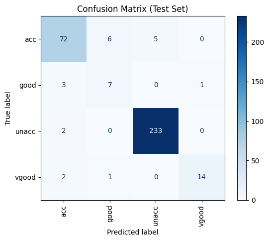

# Neural_network_Car_Evaluation
A neural network classifier implemented using Machine Learning from scratch in Python to predict car acceptability levels. Trained on the UCI Car Evaluation dataset with manual backpropagation, cost minimization, and regularization.

---
## Dataset

- The project uses the **UCI Car Evaluation dataset**, which includes 6 categorical input features:
  - Buying price
  - Maintenance cost
  - Number of doors
  - Number of persons it can carry
  - Luggage boot size
  - Safety rating
 
- You can find the dataset here:  
  🔗 [https://archive.ics.uci.edu/ml/datasets/car+evaluation](https://archive.ics.uci.edu/ml/datasets/car+evaluation)

---

## Implementation

- Converted text-based features into numbers using `LabelEncoder`  
- Built a basic neural network with one hidden layer using NumPy  
- Used the sigmoid function for neuron activation  
- Applied One-vs-All strategy for multi-class classification  
- Manually implemented forward and backward propagation  
- Trained the model using `scipy.optimize.minimize`  
- Used L2 regularization to reduce overfitting  
- Evaluated the model with accuracy, confusion matrix, and training loss curve 
---

## Results

| Metric              | Value     |
|---------------------|-----------|
| **Training Accuracy** | 96.89%    |
| **Test Accuracy**     | 94.22%    |

The model performs very well and generalizes properly without overfitting.

---

## Confusion Matrix

This shows how well the model predicted each class.

- Diagonal values are correct predictions.
- The model correctly predicted almost all `unacceptable` cars.
---
